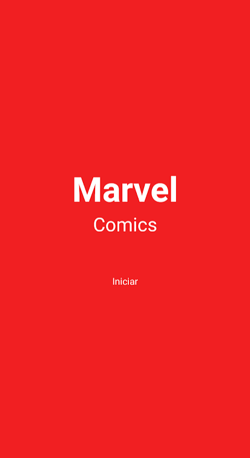
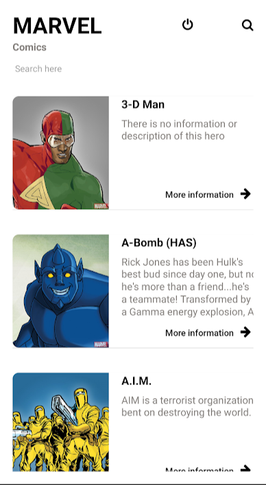
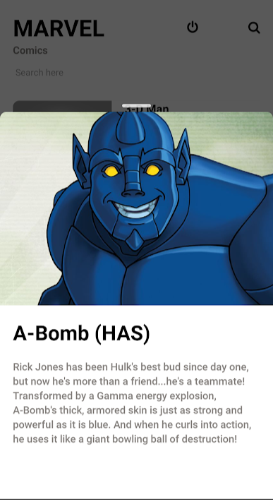

# Marvel Comics - Mobile 


[](https://github.com/VictorHCord/Marvel-Mobile)
[](https://github.com/VictorHCord/Marvel-Mobile)


Você que gosta dos heróis da marvel dos quadrinhos, poderá ver diversos tipos de heróis no quadrinhos, também conseguirá ver as descrições sobre eles e o nome dos heróis da marvel
<br>
<br>

## Template do projeto
O Template desse projeto foi inspirado puramente no projeto do dribbble do **Ruslan Riznyk**. 
[Template do projeto](https://dribbble.com/shots/4985712-Marvel-Heroes-Library)
<br>

## O que é o Marvel Comic
O aplicativo da marvel comic é um aplicativo para os fãs da marvel ou somente fãs de quadrinhos da marvel, saber mais informações sobre o(s) personagen(s) favorito(a)
[Veja mais](https://www.marvel.com/)

## Para que esse projeto serve ?
Criei esse projeto para aprender alguns conceitos e frameworks referente ao react/react-native.
<br>
Testar a api da marvel e como ela funciona. [Veja mais](https://developer.marvel.com/docs)

## Instalação

- Clone o projeto na sua área de trabalho ou em seu local de preferencia com o comando: 

``` 
git clone https://github.com/VictorHCord/Marvel-Mobile.git
```
<br>

- Clonar com SSH
```
git clone git@github.com:VictorHCord/Marvel-Mobile.git
```

<br>

- Clonar com GitHub CLI
```
gh repo clone VictorHCord/Marvel-Mobile
```

<br>


## Instalando
<br>

- Instale as dependencias com o comando: 

```
yarn install
```
ou

```
npm install
```

- Com projeto clonado e as dependencias instaladas, voce deve rodar o comando:

``` 
yarn android
```
- Observação: Antes de utilizar esse comando certifique-se que o [Android Studio](https://developer.android.com/) esteja instalado.

<br>

## :computer: Tecnologias

- React Native
- Styled components
- Typescript
- ESlint
- Prettier
- Api marvel
<br>
<br>

## Telas do aplicativo

<div>



<br>
